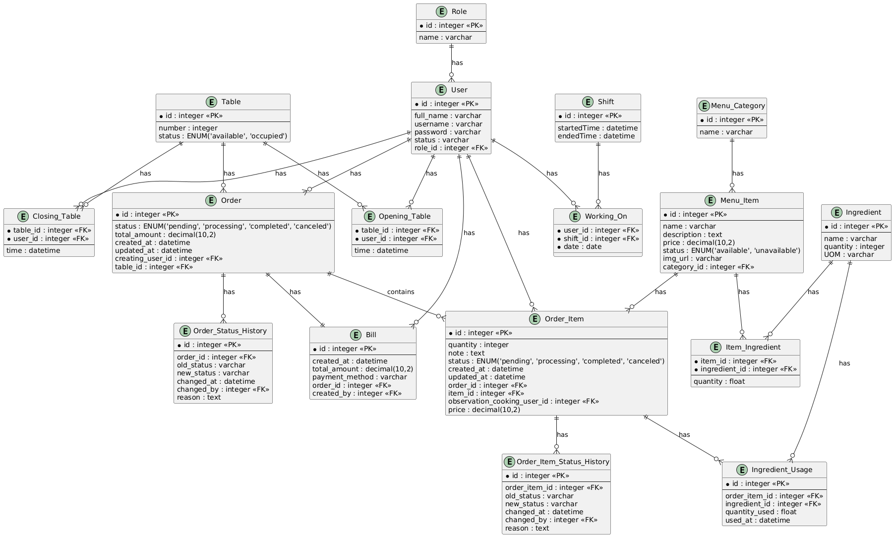

# Database Schema

## Overview

The system uses Supabase (PostgreSQL) as the database. Below is the detailed schema of all tables in the system.

## Tables

### users
```sql
CREATE TABLE users (
    id BIGSERIAL PRIMARY KEY,
    username VARCHAR(50) UNIQUE NOT NULL,
    password VARCHAR(255) NOT NULL,
    full_name VARCHAR(100) NOT NULL,
    role VARCHAR(20) NOT NULL,
    status VARCHAR(20) NOT NULL DEFAULT 'active'
);
```

### tables
```sql
CREATE TABLE tables (
    id BIGSERIAL PRIMARY KEY,
    number INT NOT NULL,
    status VARCHAR(20) NOT NULL DEFAULT 'available'
);
```

### menu_categories
```sql
CREATE TABLE menu_categories (
    id BIGSERIAL PRIMARY KEY,
    name VARCHAR(100) NOT NULL
);
```

### menu_items
```sql
CREATE TABLE menu_items (
    id BIGSERIAL PRIMARY KEY,
    name VARCHAR(100) NOT NULL,
    description TEXT,
    price DECIMAL(10,2) NOT NULL,
    status VARCHAR(20) NOT NULL DEFAULT 'available',
    img_url VARCHAR(255),
    category_id BIGINT REFERENCES menu_categories(id)
);
```

### ingredients
```sql
CREATE TABLE ingredients (
    id BIGSERIAL PRIMARY KEY,
    name VARCHAR(100) NOT NULL,
    quantity INT NOT NULL,
    uom VARCHAR(20) NOT NULL,
    unit VARCHAR(20) NOT NULL
);
```

### item_ingredients
```sql
CREATE TABLE item_ingredients (
    item_id BIGINT REFERENCES menu_items(id),
    ingredient_id BIGINT REFERENCES ingredients(id),
    quantity FLOAT NOT NULL,
    PRIMARY KEY (item_id, ingredient_id)
);
```

### orders
```sql
CREATE TABLE orders (
    id BIGSERIAL PRIMARY KEY,
    table_id BIGINT REFERENCES tables(id),
    status VARCHAR(20) NOT NULL,
    total_amount DECIMAL(10,2) NOT NULL,
    created_at TIMESTAMPTZ DEFAULT NOW(),
    updated_at TIMESTAMPTZ DEFAULT NOW(),
    user_id BIGINT REFERENCES users(id)
);
```

### order_items
```sql
CREATE TABLE order_items (
    id BIGSERIAL PRIMARY KEY,
    order_id BIGINT REFERENCES orders(id),
    item_id BIGINT REFERENCES menu_items(id),
    quantity INT NOT NULL,
    price DECIMAL(10,2) NOT NULL,
    note TEXT,
    status VARCHAR(20) NOT NULL DEFAULT 'pending',
    created_at TIMESTAMPTZ DEFAULT NOW(),
    updated_at TIMESTAMPTZ DEFAULT NOW()
);
```

### bills
```sql
CREATE TABLE bills (
    id BIGSERIAL PRIMARY KEY,
    order_id BIGINT REFERENCES orders(id),
    total_amount DECIMAL(10,2) NOT NULL,
    payment_method VARCHAR(50) NOT NULL,
    created_at TIMESTAMPTZ DEFAULT NOW(),
    user_id BIGINT REFERENCES users(id)
);
```

## Entity Relationship Diagram



## Relationships

1. **users** -> **orders**: One user can create multiple orders
2. **tables** -> **orders**: One table can have multiple orders
3. **menu_categories** -> **menu_items**: One category can have multiple menu items
4. **menu_items** -> **order_items**: One menu item can be in multiple order items
5. **orders** -> **order_items**: One order can have multiple order items
6. **orders** -> **bills**: One order has one bill
7. **menu_items** -> **item_ingredients**: One menu item can have multiple ingredients
8. **ingredients** -> **item_ingredients**: One ingredient can be used in multiple menu items
