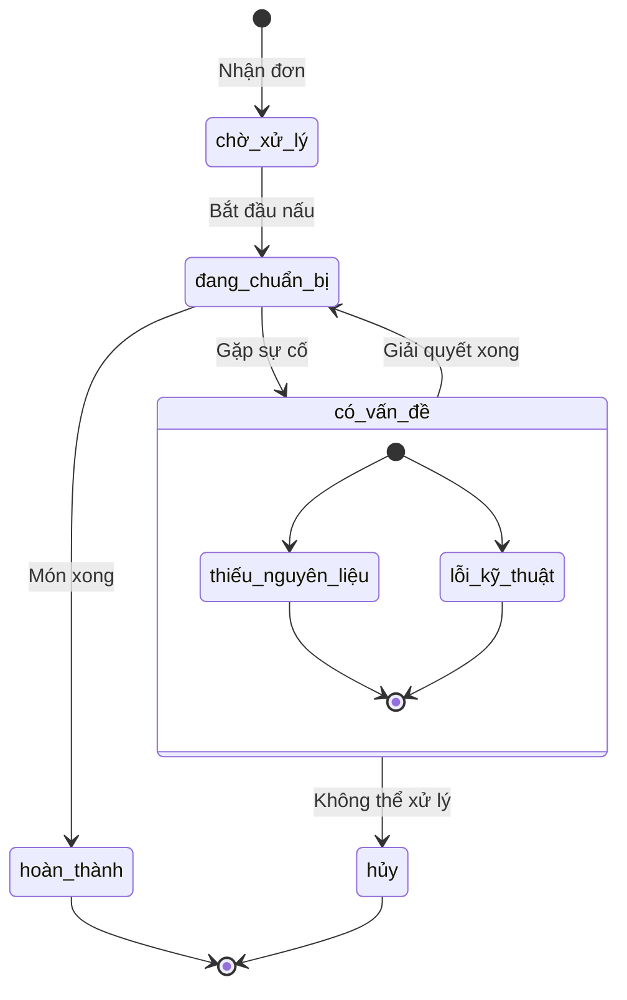

# Service Bếp (Kitchen Service)

## Tổng Quan

Service Bếp quản lý quy trình chuẩn bị món ăn trong nhà bếp, bao gồm tiếp nhận đơn hàng từ Service Đơn Hàng, phân công và theo dõi tiến độ chuẩn bị món ăn.

## URL Cơ Sở

```
http://localhost:8005
```

## Tài Liệu API
- [Swagger UI](http://localhost:8005/docs)
- [OpenAPI JSON](http://localhost:8005/openapi.json)

## Các Endpoint API

### Kiểm Tra Sức Khỏe

```http
GET /health
```

Kiểm tra trạng thái hoạt động của service và kết nối database.

### Lấy Danh Sách Món Cần Chuẩn Bị

```http
GET /kitchen/orders
```

Lấy danh sách các món ăn đang chờ chuẩn bị.

**Query Parameters:**
- `status` (tùy chọn): Lọc theo trạng thái (chờ xử lý, đang chuẩn bị, hoàn thành)
- `priority` (tùy chọn): Lọc theo độ ưu tiên

**Response:**
```json
{
    "orders": [
        {
            "order_id": 1,
            "table_number": 5,
            "items": [
                {
                    "item_id": 1,
                    "name": "Phở bò tái",
                    "quantity": 2,
                    "note": "Ít hành",
                    "status": "đang chuẩn bị"
                }
            ],
            "priority": "cao",
            "created_at": "2025-04-20T10:30:00+07:00"
        }
    ]
}
```

### Cập Nhật Trạng Thái Món

```http
PUT /kitchen/orders/{order_id}/items/{item_id}/status
```

Cập nhật trạng thái chuẩn bị của món ăn.

**Request Body:**
```json
{
    "status": "hoàn thành",
    "note": "Đã chuẩn bị xong"
}
```

### Xem Chi Tiết Đơn Bếp

```http
GET /kitchen/orders/{order_id}
```

Xem chi tiết một đơn hàng trong bếp.

### Phân Công Nhân Viên

```http
POST /kitchen/assignments
```

Phân công nhân viên bếp cho các món ăn.

**Request Body:**
```json
{
    "order_id": 1,
    "item_id": 1,
    "staff_id": 5,
    "estimated_time": 15
}
```

### Báo Cáo Vấn Đề

```http
POST /kitchen/issues
```

Báo cáo vấn đề trong quá trình chuẩn bị món ăn.

**Request Body:**
```json
{
    "order_id": 1,
    "item_id": 1,
    "issue_type": "thiếu_nguyên_liệu",
    "description": "Hết thịt bò",
    "severity": "cao"
}
```

## Quy Trình Chuẩn Bị Món



## Mã Lỗi

| Mã Lỗi | Mô Tả |
|---------|-------------|
| 400 | Yêu cầu không hợp lệ - Dữ liệu đầu vào sai |
| 404 | Không tìm thấy - Đơn hàng/Món không tồn tại |
| 409 | Xung đột - Trạng thái không hợp lệ |
| 500 | Lỗi hệ thống |
