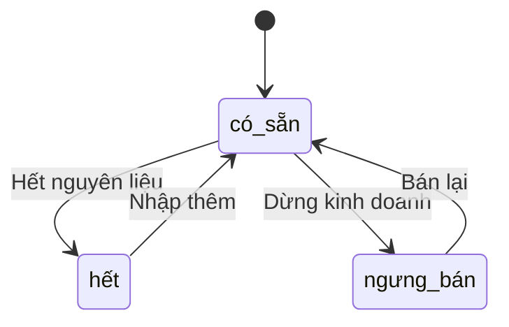

# Service Thực Đơn (Menu Service)

## Tổng Quan

Service Thực Đơn quản lý danh mục món ăn, giá cả và trạng thái món trong nhà hàng. Service này cũng quản lý thông tin về nguyên liệu của từng món.

## URL Cơ Sở

```
http://localhost:8003
```

## Tài Liệu API
- [Swagger UI](http://localhost:8003/docs)
- [OpenAPI JSON](http://localhost:8003/openapi.json)

## Các Endpoint API

### Kiểm Tra Sức Khỏe

```http
GET /health
```

Kiểm tra trạng thái hoạt động của service và kết nối database.

### Lấy Danh Mục

```http
GET /categories
```

Lấy danh sách các danh mục món ăn.

**Response:**
```json
{
    "categories": [
        {
            "id": 1,
            "name": "Món khai vị",
            "description": "Các món ăn nhẹ khai vị"
        },
        {
            "id": 2,
            "name": "Món chính",
            "description": "Các món ăn chính"
        }
    ]
}
```

### Lấy Danh Sách Món Ăn

```http
GET /items
```

Lấy danh sách tất cả các món ăn.

**Query Parameters:**
- `category_id` (tùy chọn): Lọc theo danh mục
- `status` (tùy chọn): Lọc theo trạng thái (có sẵn, hết, ngưng bán)
- `search` (tùy chọn): Tìm kiếm theo tên món

### Xem Chi Tiết Món Ăn

```http
GET /items/{item_id}
```

Xem thông tin chi tiết của một món ăn.

### Thêm Món Ăn Mới

```http
POST /items
```

Thêm món ăn mới vào thực đơn.

**Request Body:**
```json
{
    "name": "Phở bò tái",
    "description": "Phở bò với thịt bò tái",
    "price": 65000,
    "category_id": 2,
    "image_url": "pho-bo-tai.jpg",
    "ingredients": [
        {
            "ingredient_id": 1,
            "quantity": 200,
            "unit": "gram"
        }
    ]
}
```

### Cập Nhật Giá Món Ăn

```http
PUT /items/{item_id}/price
```

Cập nhật giá của món ăn.

**Request Body:**
```json
{
    "price": 70000
}
```

### Cập Nhật Trạng Thái Món Ăn

```http
PUT /items/{item_id}/status
```

Cập nhật trạng thái của món ăn.

**Request Body:**
```json
{
    "status": "hết"
}
```

## Quản Lý Nguyên Liệu

### Kiểm Tra Tồn Kho

```http
GET /ingredients
```

Kiểm tra số lượng nguyên liệu trong kho.

### Cập Nhật Số Lượng

```http
PUT /ingredients/{ingredient_id}/quantity
```

Cập nhật số lượng nguyên liệu.

**Request Body:**
```json
{
    "quantity": 100,
    "unit": "kg"
}
```

## Trạng Thái Món Ăn



## Mã Lỗi

| Mã Lỗi | Mô Tả |
|---------|-------------|
| 400 | Yêu cầu không hợp lệ - Dữ liệu đầu vào sai |
| 404 | Không tìm thấy - Món ăn không tồn tại |
| 409 | Xung đột - Món ăn đã tồn tại |
| 500 | Lỗi hệ thống |
