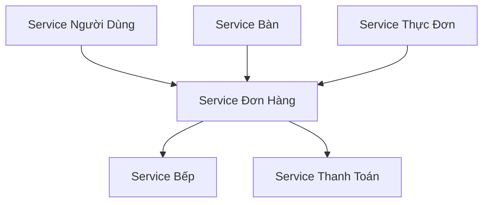

# Tổng Quan Các Service

## Kiến Trúc

Hệ thống quản lý nhà hàng của chúng ta được xây dựng theo kiến trúc microservices, trong đó mỗi service chịu trách nhiệm cho một chức năng cụ thể. Tất cả các service đều được đóng gói trong Docker và giao tiếp với nhau thông qua API HTTP/REST.

## Kiểm Tra Sức Khỏe Service

Mỗi service đều cung cấp hai endpoint tiêu chuẩn:

- `GET /` - Endpoint gốc trả về trạng thái service
- `GET /health` - Endpoint kiểm tra sức khỏe trả về thông tin chi tiết về tình trạng service

## Tính Năng Chung

Tất cả các service đều có các tính năng chung sau:

- Framework FastAPI
- Tài liệu Swagger UI tại `/docs`
- Middleware CORS được bật
- Kết nối cơ sở dữ liệu Supabase
- Giám sát sức khỏe
- Hỗ trợ Unicode cho tiếng Việt

## Phụ Thuộc Giữa Các Service



## Cổng Kết Nối Service

| Service | Cổng | Chức Năng Chính |
|---------|------|------------------|
| Service Người Dùng | 8001 | Xác thực & Quản lý người dùng |
| Service Bàn | 8002 | Quản lý bàn |
| Service Thực Đơn | 8003 | Quản lý thực đơn & món ăn |
| Service Đơn Hàng | 8004 | Xử lý đơn hàng |
| Service Bếp | 8005 | Vận hành bếp |
| Service Thanh Toán | 8006 | Xử lý thanh toán |

## Xử Lý Lỗi

Tất cả các service đều tuân theo định dạng phản hồi lỗi tiêu chuẩn:

```json
{
    "detail": {
        "status": "lỗi",
        "message": "Mô tả lỗi",
        "timestamp": "2025-04-20T10:40:39+07:00"
    }
}````
