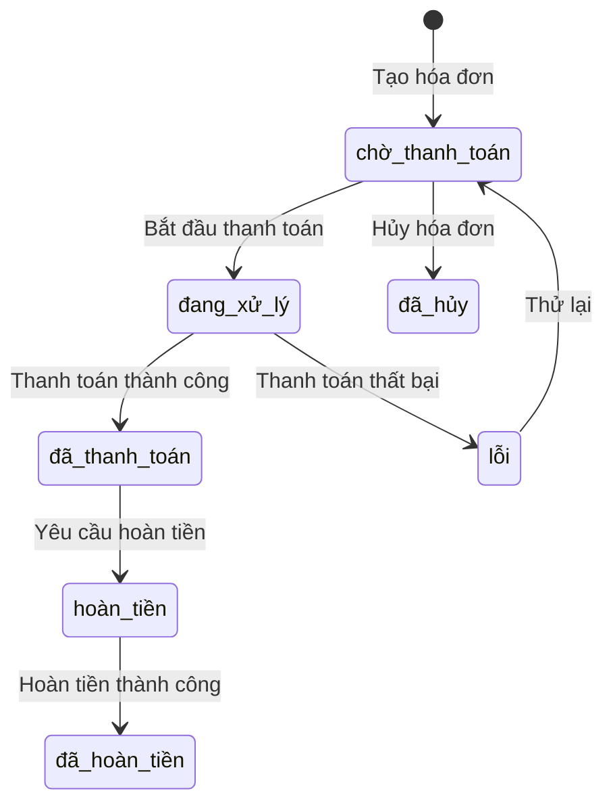

# Service Thanh Toán (Payment Service)

## Tổng Quan

Service Thanh Toán xử lý tất cả các giao dịch thanh toán trong nhà hàng, bao gồm tạo hóa đơn, xử lý thanh toán và quản lý doanh thu.

## URL Cơ Sở

```
http://localhost:8006
```

## Tài Liệu API
- [Swagger UI](http://localhost:8006/docs)
- [OpenAPI JSON](http://localhost:8006/openapi.json)

## Các Endpoint API

### Kiểm Tra Sức Khỏe

```http
GET /health
```

Kiểm tra trạng thái hoạt động của service và kết nối database.

### Tạo Hóa Đơn

```http
POST /bills
```

Tạo hóa đơn mới cho đơn hàng.

**Request Body:**
```json
{
    "order_id": 1,
    "payment_method": "tiền mặt",
    "user_id": 5
}
```

### Xem Chi Tiết Hóa Đơn

```http
GET /bills/{bill_id}
```

Xem thông tin chi tiết của một hóa đơn.

**Response:**
```json
{
    "id": 1,
    "order_id": 1,
    "items": [
        {
            "name": "Phở bò tái",
            "quantity": 2,
            "price": 65000,
            "total": 130000
        }
    ],
    "subtotal": 130000,
    "tax": 13000,
    "total": 143000,
    "payment_method": "tiền mặt",
    "status": "đã thanh toán",
    "created_at": "2025-04-20T11:30:00+07:00"
}
```

### Xử Lý Thanh Toán

```http
POST /bills/{bill_id}/process
```

Xử lý thanh toán cho hóa đơn.

**Request Body:**
```json
{
    "payment_method": "thẻ",
    "amount": 143000,
    "card_info": {
        "type": "visa",
        "last_4_digits": "1234"
    }
}
```

### Hủy Hóa Đơn

```http
POST /bills/{bill_id}/cancel
```

Hủy hóa đơn.

**Request Body:**
```json
{
    "reason": "Khách hàng yêu cầu",
    "user_id": 5
}
```

### Báo Cáo Doanh Thu

```http
GET /reports/revenue
```

Xem báo cáo doanh thu.

**Query Parameters:**
- `from_date`: Ngày bắt đầu
- `to_date`: Ngày kết thúc
- `type`: Loại báo cáo (ngày, tuần, tháng)

**Response:**
```json
{
    "period": "2025-04",
    "total_revenue": 15000000,
    "total_bills": 100,
    "payment_methods": {
        "tiền mặt": 8000000,
        "thẻ": 7000000
    },
    "daily_revenue": [
        {
            "date": "2025-04-20",
            "revenue": 1500000
        }
    ]
}
```

## Quy Trình Thanh Toán



## Phương Thức Thanh Toán

- Tiền mặt
- Thẻ ngân hàng
- Ví điện tử
- Chuyển khoản

## Mã Lỗi

| Mã Lỗi | Mô Tả |
|---------|-------------|
| 400 | Yêu cầu không hợp lệ - Dữ liệu đầu vào sai |
| 404 | Không tìm thấy - Hóa đơn không tồn tại |
| 409 | Xung đột - Hóa đơn đã được thanh toán |
| 422 | Lỗi xử lý - Thanh toán thất bại |
| 500 | Lỗi hệ thống |
