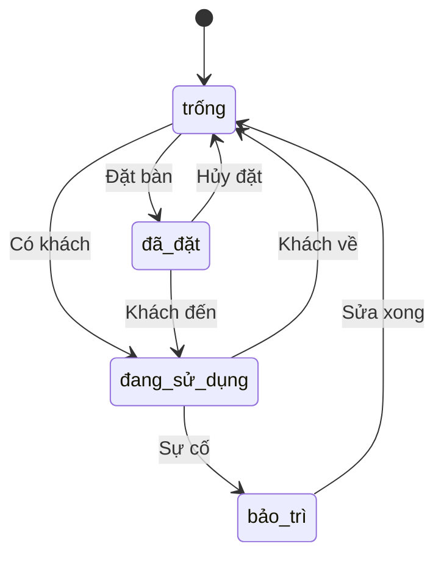

# Service Bàn (Table Service)

## Tổng Quan

Service Bàn quản lý tất cả các bàn trong nhà hàng, bao gồm trạng thái bàn, sắp xếp và đặt bàn.

## URL Cơ Sở

```
http://localhost:8002
```

## Tài Liệu API
- [Swagger UI](http://localhost:8002/docs)
- [OpenAPI JSON](http://localhost:8002/openapi.json)

## Các Endpoint API

### Kiểm Tra Sức Khỏe

```http
GET /health
```

Kiểm tra trạng thái hoạt động của service và kết nối database.

### Lấy Danh Sách Bàn

```http
GET /tables
```

Lấy danh sách tất cả các bàn trong nhà hàng.

**Query Parameters:**
- `status` (tùy chọn): Lọc theo trạng thái (trống, đã đặt, đang sử dụng)

**Response:**
```json
{
    "tables": [
        {
            "id": 1,
            "number": 1,
            "status": "trống",
            "capacity": 4
        },
        {
            "id": 2,
            "number": 2,
            "status": "đang sử dụng",
            "capacity": 6
        }
    ]
}
```

### Xem Chi Tiết Bàn

```http
GET /tables/{table_id}
```

Xem thông tin chi tiết của một bàn cụ thể.

### Thêm Bàn Mới

```http
POST /tables
```

Thêm bàn mới vào hệ thống.

**Request Body:**
```json
{
    "number": 3,
    "capacity": 4,
    "location": "Tầng 1"
}
```

### Cập Nhật Trạng Thái Bàn

```http
PUT /tables/{table_id}/status
```

Cập nhật trạng thái của bàn.

**Request Body:**
```json
{
    "status": "đang sử dụng"
}
```

### Đặt Bàn

```http
POST /tables/{table_id}/reserve
```

Đặt bàn cho khách hàng.

**Request Body:**
```json
{
    "customer_name": "Nguyễn Văn A",
    "phone": "0123456789",
    "time": "2025-04-20T18:00:00+07:00",
    "number_of_guests": 4,
    "note": "Gần cửa sổ"
}
```

## Trạng Thái Bàn



## Mã Lỗi

| Mã Lỗi | Mô Tả |
|---------|-------------|
| 400 | Yêu cầu không hợp lệ - Dữ liệu đầu vào sai |
| 404 | Không tìm thấy - Bàn không tồn tại |
| 409 | Xung đột - Bàn đã được đặt/sử dụng |
| 500 | Lỗi hệ thống |
