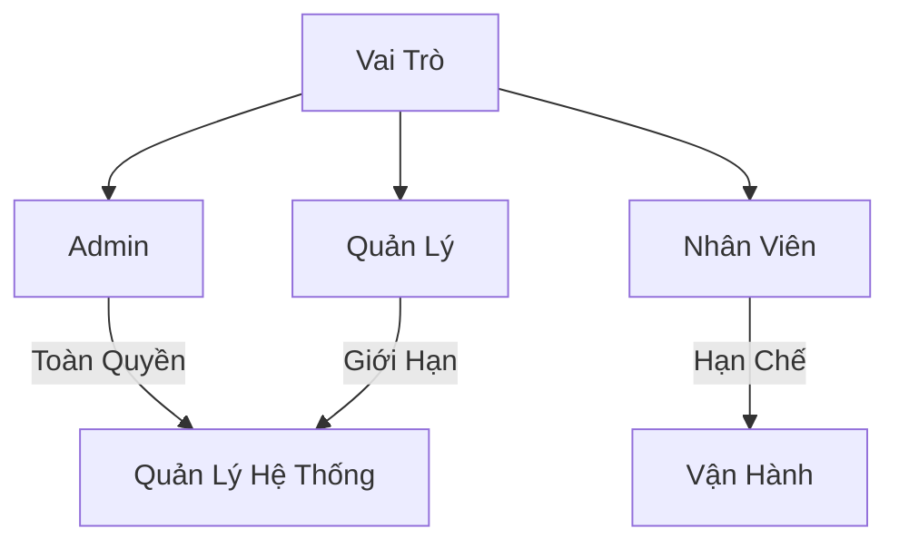

# Service Người Dùng (User Service)

## Tổng Quan

Service Người Dùng quản lý việc xác thực và phân quyền người dùng trong hệ thống nhà hàng. Service này xử lý việc đăng nhập, đăng xuất và quản lý thông tin người dùng.

## URL Cơ Sở

```
http://localhost:8001
```

## Tài Liệu API
- [Swagger UI](http://localhost:8001/docs)
- [OpenAPI JSON](http://localhost:8001/openapi.json)

## Các Endpoint API

### Kiểm Tra Sức Khỏe

```http
GET /health
```

Kiểm tra trạng thái hoạt động của service và kết nối database.

### Đăng Nhập

```http
POST /auth/login
```

Xác thực người dùng và cấp token truy cập.

**Request Body:**
```json
{
    "username": "admin",
    "password": "admin123"
}
```

**Response:**
```json
{
    "access_token": "eyJ0eXAiOiJKV1QiLCJhbGciOiJIUzI1NiJ9...",
    "token_type": "bearer",
    "user": {
        "id": 1,
        "username": "admin",
        "full_name": "Admin",
        "role": "admin"
    }
}
```

### Lấy Thông Tin Người Dùng Hiện Tại

```http
GET /users/me
```

Lấy thông tin của người dùng đã đăng nhập.

**Headers:**
```
Authorization: Bearer {access_token}
```

### Tạo Người Dùng Mới

```http
POST /users
```

Tạo tài khoản người dùng mới.

**Request Body:**
```json
{
    "username": "nhanvien1",
    "password": "password123",
    "full_name": "Nhân Viên 1",
    "role": "staff"
}
```

### Cập Nhật Người Dùng

```http
PUT /users/{user_id}
```

Cập nhật thông tin người dùng.

**Request Body:**
```json
{
    "full_name": "Nhân Viên Một",
    "role": "staff"
}
```

### Thay Đổi Mật Khẩu

```http
PUT /users/{user_id}/password
```

Thay đổi mật khẩu người dùng.

**Request Body:**
```json
{
    "old_password": "password123",
    "new_password": "newpassword123"
}
```

## Vai Trò Người Dùng



## Mã Lỗi

| Mã Lỗi | Mô Tả |
|---------|-------------|
| 400 | Yêu cầu không hợp lệ - Dữ liệu đầu vào sai |
| 401 | Chưa xác thực - Token không hợp lệ |
| 403 | Không có quyền - Không đủ quyền truy cập |
| 404 | Không tìm thấy - Người dùng không tồn tại |
| 500 | Lỗi hệ thống |
